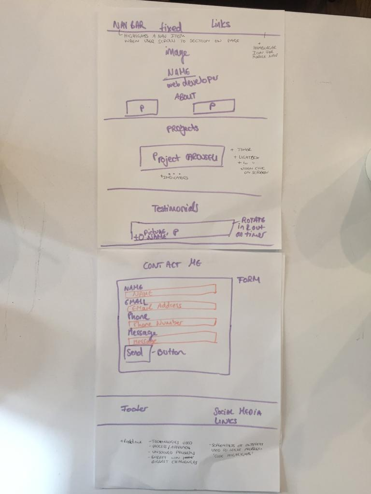

# URL to my site: https://ch264.github.io/

## My approach:
To make the website I used HTML, CSS, jQuery and Bootstrap.
I first wireframed the website and then worked my way from top to bottom through my mapped out sections. Once the skeleton with HTML and CSS was done, I started with the animations with jQuery and bootstrap.

## Biggest wins:

Learnings of the following:
- writing pseudocode from the get go greatly increases structe and keeping focus
- check that CDN is included in document.
- when using plugins, check their github pages for up to date information
- learning to read Bootstrap documentation and style my page with it
- underlining Nav a links when scrolling to corresponding section on the page
  

## challenges:
- applying the lightbox to the library with bootstrap lightbox
- using jQuery to animate the nav bar items to the according sections on the page.
- finding a balance with all the script tags and CDNs that can were included
- background image in header should be opacity 0.5 but then H1 and H2 also change opacity
- flashing quotes I was struggeling and shamefully copied a code solution. I vow to work on this to create my own javaScript/jQuery to figure out how to make this work
  

## unfinished:
- the nav bar item animation jQuery could be solved better. I would like to write a function to make this part more scalable as now the sections are hard coded into each
  if/else statement and I do not like that.
 - I tried to include a parallax effect on the background image that zooms: like this: https://mdbootstrap.com/previews/docs/latest/html/parallax/index.html
    https://www.taniarascia.com/parallax-scroll-effect/
- The H1 and H2 should fly in from both sides
- nav a links uppercase
- add in webkits for cross browser compatibility
- add github link to social links and add github links to repos in projects
- change fonts
- add an API

- I want to build my page on JavaScript and jQuery down the line, instead of bootstrap.
    build a plugin for carousel
    https://archive.barrelny.com/blog/building-a-jquery-slideshow-plugin-from-scratch/

    // build a carousel with jquery
    https://stackoverflow.com/questions/12608356/how-to-build-simple-jquery-image-slider-with-sliding-or-opacity-effect

    // how to create an image slider with javascript
    https://coderwall.com/p/vsdrug/how-to-create-an-image-slider-with-javascript

### Pseudocode for Image Carousel:

// active image1 is displayed (on top of other images that are hidden)
  // set Timer
  // if timer ends
// image 1 slides to left and behind the stack
// image 2 fully displayed
  //set timer
  // if timer ends
// repeat image3

// button1 below hightlight when image1 is in view
// same for other buttons

// add Event delegation to listen to click on each button
  // if user clicks on button1, display image1
  // if user clicks on button2, dispay image2
  // if user clicks on button3 display image3

// add Event delegation to listen to click on image
  // enlarge image
  // display image in lightbox
    // (display github link?)

// if user clicks on window
  //hide lightbox
  //decrease image size

### Pseudocode for flashing testimonials:

// setTimer runs indefinetly
// testimonials rotate in and out on a timer
 // active Testimonial is displayed

 // start timer
 // when timer === 0
 // fade out displayed Testimonal
 // fade in second Testimonial
 // start timer

